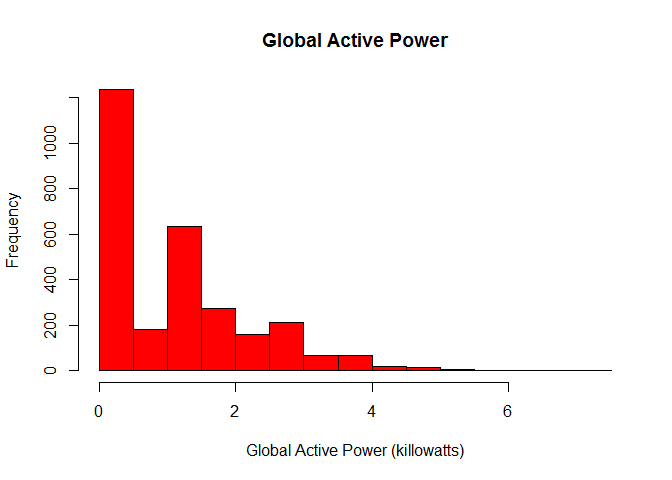
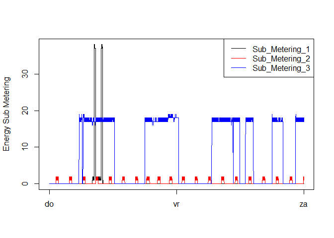
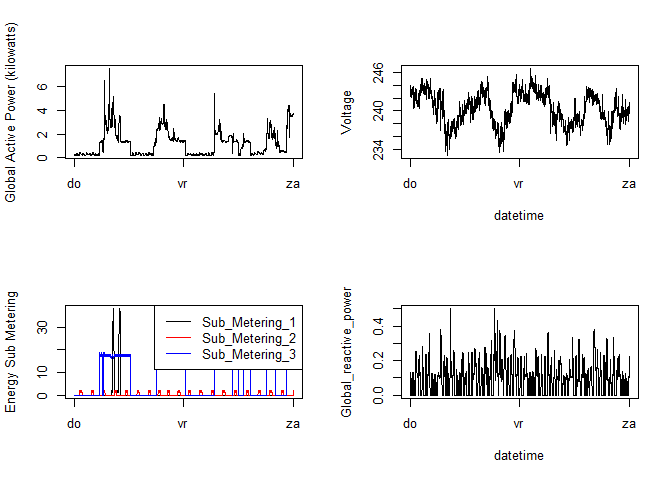

# Assignment 1 Exploratory Data Analysis
Desiré De Waele  
25 februari 2016  

Our overall goal here is simply to examine how household energy usage varies over a 2-day period in February, 2007. The task is to reconstruct certain given plots, all of which were constructed using the base plotting system.

The data was retrieved from this source:
https://d396qusza40orc.cloudfront.net/exdata%2Fdata%2Fhousehold_power_consumption.zip

## Plot 1

```r
library(dplyr)
library(lubridate)

# reading relevant data
data <- read.table("household_power_consumption.txt", sep = ";", skip = 66637, nrows = 2880)

# clearing name row and unrelevant variables, creating numerics
data <- data %>% select(V3) %>% mutate(V3 = as.numeric(as.character(V3)))

# create histogram
hist(data$V3, col = "red", main = "Global Active Power",
     xlab = "Global Active Power (killowatts)", ylab = "Frequency")
```



## Plot 2

```r
# reading relevant data
data <- read.table("household_power_consumption.txt", sep = ";", skip = 66637, nrows = 2880)

# clearing name row and unrelevant variables, casting to right classes
data <- data %>% mutate(V1 = as.POSIXct(dmy_hms(as.character(paste(V1, V2)))),
               V3 = as.numeric(as.character(V3))) %>% select(V1,V3)

# create plot
with(data, plot(V1,V3, type="l", xlab = "", ylab = "Global Active Power (kilowatts)"))
```


## Plot 3

```r
# reading relevant data
data <- read.table("household_power_consumption.txt", sep = ";", skip = 66637, nrows = 2880)

# clearing name row and unrelevant variables, casting to right classes
data <- data %>% mutate(V1 = as.POSIXct(dmy_hms(as.character(paste(V1, V2)))),
               V7 = as.numeric(as.character(V7)),
               V8 = as.numeric(as.character(V8)),
               V9 = as.numeric(as.character(V9))) %>% select(V1,V7:V9)

# create plot
with(data, plot(V1,V7, type="n", xlab = "", ylab = "Energy Sub Metering"))
with(data, points(V1,V7, col="black", type="l"))
with(data, points(V1,V8, col="red", type="l"))
with(data, points(V1,V9, col="blue", type="l"))
legend("topright", lty=1, col = c("black", "red", "blue"), 
       legend = c("Sub_Metering_1", "Sub_Metering_2", "Sub_Metering_3"))
```



## Plot 4

```r
# reading relevant data
data <- read.table("household_power_consumption.txt", sep = ";", skip = 66637, nrows = 2880)

# clearing name row and unrelevant variables, casting to right classes
data <- data %>% mutate(V1 = as.POSIXct(dmy_hms(as.character(paste(V1, V2)))),
               V3 = as.numeric(as.character(V3)),
               V4 = as.numeric(as.character(V4)),
               V5 = as.numeric(as.character(V5)),
               V7 = as.numeric(as.character(V7)),
               V8 = as.numeric(as.character(V8)),
               V9 = as.numeric(as.character(V9)))

# create plot
par(mfrow = c(2, 2))

with(data, plot(V1,V3, type="l", xlab = "", ylab = "Global Active Power (kilowatts)"))

with(data, plot(V1,V5, type="l", xlab = "datetime", ylab = "Voltage"))

with(data, plot(V1,V7, type="n", xlab = "", ylab = "Energy Sub Metering"))
with(data, points(V1,V7, col="black", type="l"))
with(data, points(V1,V8, col="red", type="l"))
with(data, points(V1,V9, col="blue", type="l"))
legend("topright", lty=1, col = c("black", "red", "blue"), 
       legend = c("Sub_Metering_1", "Sub_Metering_2", "Sub_Metering_3"))

with(data, plot(V1,V4, type="l", xlab = "datetime", ylab = "Global_reactive_power"))
```



