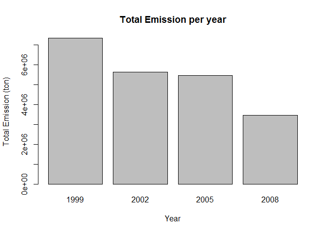
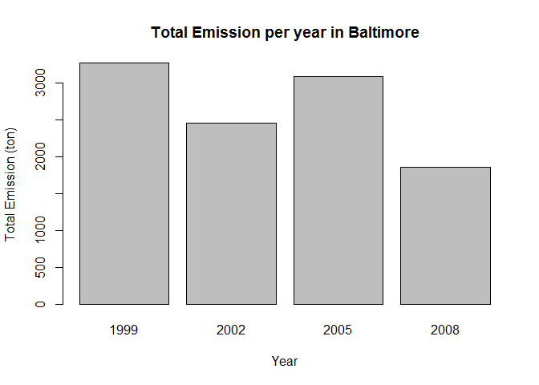
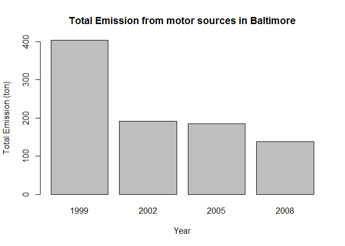

# Assignment 2 Exploratory Data Analysis
Desiré De Waele  
25 februari 2016  
The overall goal of this assignment is to explore the National Emissions Inventory database and see what it say about fine particulate matter pollution in the United states over the 10-year period 1999-2008.

The data was retrieved from this source:
https://d396qusza40orc.cloudfront.net/exdata%2Fdata%2FNEI_data.zip

# Question 1
Have total emissions from PM2.5 decreased in the United States from 1999 to 2008? Using the base plotting system, make a plot showing the total PM2.5 emission from all sources for each of the years 1999, 2002, 2005, and 2008.

```r
# reading data
NEI <- readRDS("summarySCC_PM25.rds")
SCC <- readRDS("Source_Classification_Code.rds")

# summing emission data per year
totalEmissions <- tapply(NEI$Emissions, NEI$year, sum)

# plotting
barplot(totalEmissions, xlab = "Year", ylab = "Total Emission (ton)", 
        main = "Total Emission per year")
```



# Question 2
Have total emissions from PM2.5 decreased in the Baltimore City, Maryland (fips == "24510") from 1999 to 2008? Use the base plotting system to make a plot answering this question.

```r
# reading and subsetting data
balt <- subset(NEI, fips == "24510")

# summing emissions per year
totalEmissions <- tapply(balt$Emissions, balt$year, sum)

# plotting
barplot(totalEmissions, xlab = "Year", ylab = "Total Emission (ton)", 
        main = "Total Emission per year in Baltimore")
```



# Question 3
Of the four types of sources indicated by the type (point, nonpoint, onroad, nonroad) variable, which of these four sources have seen decreases in emissions from 1999-2008 for Baltimore City? Which have seen increases in emissions from 1999-2008? Use the ggplot2 plotting system to make a plot answer this question.

```r
library(ggplot2)

# summing emission data per year per type
data <- aggregate(Emissions ~ year + type, balt, sum)

# plotting
g <- ggplot(data, aes(year, Emissions, color = type))
g + geom_line() +
        xlab("Year") +
        ylab(expression("Total PM"[2.5]*" Emissions")) +
        ggtitle("Total Emissions per type in Baltimore")
```


# Question 4
Across the United States, how have emissions from coal combustion-related sources changed from 1999-2008?

```r
# subsetting SCC with coal values
coalMatches  <- grepl("coal", SCC$Short.Name, ignore.case=TRUE)
subsetSCC <- SCC[coalMatches, ]

# merging dataframes
NEISCC <- merge(NEI, subsetSCC, by="SCC")

# summing emission data per year
totalEmissions <- tapply(NEISCC$Emissions, NEISCC$year, sum)

# plotting
barplot(totalEmissions, xlab = "Year", ylab = "Total Emission (ton)", 
        main = "Total Emission from coal sources")
```


# Question 5
How have emissions from motor vehicle sources changed from 1999-2008 in Baltimore City?

```r
# subsetting SCC with vehicle values
vehicleMatches  <- grepl("vehicle", SCC$SCC.Level.Two, ignore.case=TRUE)
subsetSCC <- SCC[vehicleMatches, ]

# merging dataframes
NEISCC <- merge(balt, subsetSCC, by="SCC")

# summing emission data per year per type
totalEmissions <- tapply(NEISCC$Emissions, NEISCC$year, sum)

# plotting
barplot(totalEmissions, xlab = "Year", ylab = "Total Emission (ton)", 
        main = "Total Emission from motor sources in Baltimore")
```



# Question 6
Compare emissions from motor vehicle sources in Baltimore City with emissions from motor vehicle sources in Los Angeles County, California (fips == "06037"). Which city has seen greater changes over time in motor vehicle emissions?

```r
los <- subset(NEI, fips == "06037")

# subsetting SCC with vehicle values
vehicleMatches  <- grepl("vehicle", SCC$SCC.Level.Two, ignore.case=TRUE)
subsetSCC <- SCC[vehicleMatches, ]

# merging dataframes, adding city variable
dataBalt <- merge(balt, subsetSCC, by="SCC")
dataBalt$city <- "Baltimore City"
dataLos <- merge(los, subsetSCC, by="SCC")
dataLos$city <- "Los Angeles County"
data <- rbind(dataBalt, dataLos)

# summing emission data per year per type
data <- aggregate(Emissions ~ year + city, data, sum)

# plotting
g <- ggplot(data, aes(year, Emissions, color = city))
g + geom_line() +
        xlab("Year") +
        ylab(expression("Total PM"[2.5]*" Emissions")) +
        ggtitle("Total Emissions from motor sources in Baltimore and Los Angeles")
```


